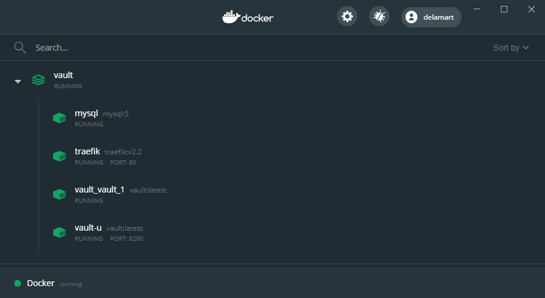

# Vault mutual unseal

Here is how you can setup two seperate vaults to mutually unseal each other using the transit secret engine.



Hashicorp vault website: https://www.vaultproject.io

## Requirements

You'll need:
- docker
- docker-compose

For this tutorial you'll need to setup the local hostname `vault.localhost` in your `hosts` file and point it to `127.0.0.1`.

## Tutorial

### Pull and Build

Let's start by pulling the required images and building the vault-cli image used for our scripts.

```
> docker-compose -f docker-compose.yml -f dc.vault-cli.yml pull
Pulling db         ... done
Pulling traefik    ... done
Pulling vault-cli  ... done
> docker-compose -f docker-compose.yml -f dc.vault-cli.yml build
```


### Start the LB and DB

First we setup a MySQL database and traefik load balancer so we can test a highly available setup for our main vault images.
This will then allow us to simulate scaling the vault cluster up and down and testing it's resilience.

```
> docker-compose up -d
Creating network "vault_net" with the default driver
Creating traefik ... done
Creating mysql   ... done
```
:warning: Make sure you wait for MySQL to be ready by checking the logs for `mysqld: ready for connections.`

### Start the unlock-vault

Now we'll start the first vault instance. This will be our "unlock vault" (vault-u). This is the vault instance who's sole job
is to unlock the other vaults. The `vault-u-init.sh` script will initialize the vault instance as well as unseal it and then
setup the transit engine, key and a token to unlock our main vault. You will find the unseal key and root token in `secrets/init-u.json`.
The token used by the main vault to connect to our vault-u is stored under `secrets/token.json` and is copied into `vault.env` so
it can be loaded as an ENV variable by the main vault.

:zap: The `vault-u-init.sh` script will also create a copy of the unlock vault's files from `vault/*` to `vault-with-seal/*` which we 
can later use to recover if both vaults are down, as the transit key will be backed-up.

```
> docker-compose -f docker-compose.yml -f dc.vault-u.yml up -d
traefik is up-to-date
mysql is up-to-date
Creating vault-u ... done

> docker-compose -f docker-compose.yml -f dc.vault-u.yml -f dc.vault-cli.yml run --rm vault-cli /home/vault/vault-u-init.sh
```
:heavy_check_mark: You can now visit http://vault.localhost:8200/ui/ and see that the vault is initialized and unsealed.

### Sart the main vault

We can now start our main vault instance. This will be the HA one which is connected to the MySQL database. The `vault-init.sh` script
will initialize the vault and setup the transit engine, key and a token to unlock the unlock vault. You will find the recover key
and root token in `secrets/init.json`. The token used by the unlock vault to connect to our main vault is stored under 
`secrets/token-u.json` and is copied to `vault-u.env` so it can be loaded as an ENV variable by the unlock vault.

```
> docker-compose -f docker-compose.yml -f dc.vault-u.yml -f dc.vault.yml up -d
traefik is up-to-date
vault-u is up-to-date
mysql is up-to-date
Creating vault_vault_1 ... done

> docker-compose -f docker-compose.yml -f dc.vault-u.yml -f dc.vault.yml -f dc.vault-cli.yml run --rm vault-cli /home/vault/vault-init.sh
```
:heavy_check_mark: You can now visit http://vault.localhost/ui/ and see that our main vault is also initialized and has been
automatically unsealed.

### Migrate to autounseal

Now let's migrate the unlock vault from SHAMIR keys to autounseal using the transit key setup in our main vault. The `migrate.sh` script
will use the existing unseal key from `secrets/init-u.json` to migrate the seal.

```
> docker-compose -f docker-compose.yml -f dc.vault-u.yml -f dc.vault.yml -f dc.seal.yml up -d
mysql is up-to-date
Recreating vault-u ...
traefik is up-to-date
Recreating vault-u ... done

> docker-compose -f docker-compose.yml -f dc.vault-u.yml -f dc.vault.yml -f dc.vault-cli.yml run --rm vault-cli /home/vault/migrate.sh
```
:heavy_check_mark: You can now visit http://vault.localhost:8200/ui/ and see that our unlock vault is again ready.

### Scaling

We can now try scaling the main vault up to two instances to show that both will be automatically unsealed.
You can also scale down the unlock vault to 0 (deleting it) and then bring it back up to see that it will also automatically unseal.

```
> docker-compose -f docker-compose.yml -f dc.vault-u.yml -f dc.vault.yml -f dc.seal.yml up -d --scale vault=2
traefik is up-to-date
vault-u is up-to-date
mysql is up-to-date
Starting vault_vault_1 ... done
Creating vault_vault_2 ... done

> docker-compose -f docker-compose.yml -f dc.vault-u.yml -f dc.vault.yml -f dc.seal.yml up -d --scale vault-u=0
Stopping and removing vault-u ...
traefik is up-to-date
Stopping and removing vault-u       ... done
Stopping and removing vault_vault_2 ... done
Starting vault_vault_1              ... done

> docker-compose -f docker-compose.yml -f dc.vault-u.yml -f dc.vault.yml -f dc.seal.yml up -d
mysql is up-to-date
traefik is up-to-date
vault_vault_1 is up-to-date
Creating vault-u ... done

```

### Recovery

:boom: One of the main issues with mutual auto-unseal is what happens when both vaults are down. If you bring them back up both will
fail as you need one to be unsealed to unlock the other. The solution here is to restore the backup we made before migrating to the
transit seal. This way we can go back to a version of the unlock vault that still has the same transit key but can be unlocked
manually using it's original unseal key.

```
> docker-compose up -d --remove-orphans
Removing orphan container "vault_vault_1"
Removing orphan container "vault-u"
mysql is up-to-date
traefik is up-to-date

> docker-compose -f docker-compose.yml -f dc.vault-u.yml up -d
mysql is up-to-date
traefik is up-to-date
Creating vault-u ... done

> docker-compose -f docker-compose.yml -f dc.vault-u.yml -f dc.vault-cli.yml run --rm vault-cli /home/vault/unseal.sh

> docker-compose -f docker-compose.yml -f dc.vault-u.yml -f dc.vault.yml up -d
vault-u is up-to-date
mysql is up-to-date
traefik is up-to-date
Creating vault_vault_1 ... done

> docker-compose -f docker-compose.yml -f dc.vault-u.yml -f dc.vault.yml -f dc.seal.yml up -d
traefik is up-to-date
Recreating vault-u ...
mysql is up-to-date
Recreating vault-u ... done
```

## Cleanup

```
> docker-compose down --remove-orphans
> rm -rf db/*
> rm -rf vault/*
> rm -rf vault-with-seal/*
> rm -rf secrets/*
```

## Source

- This tutorial is hosted on github : https://github.com/delamart/vault-mutual-unseal-tutorial
- Author : [Erik De Lamarter](https://delamart.github.io/)